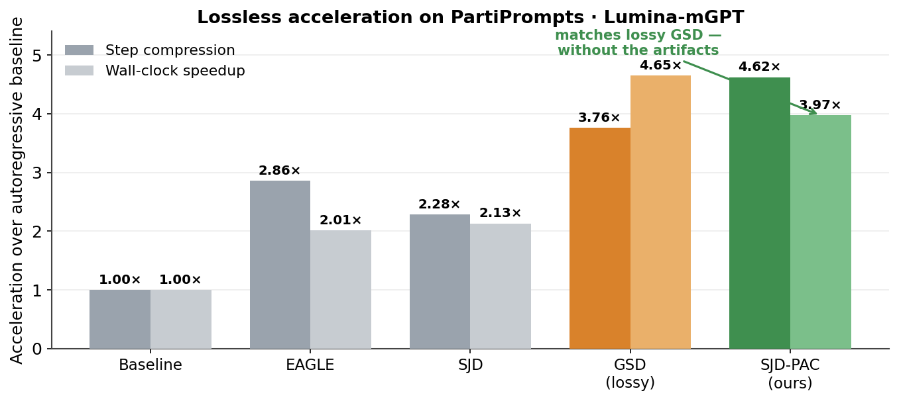
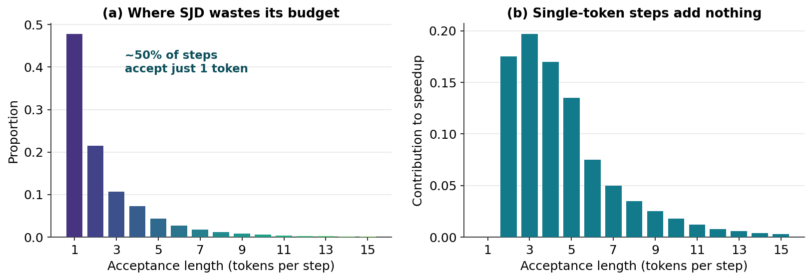
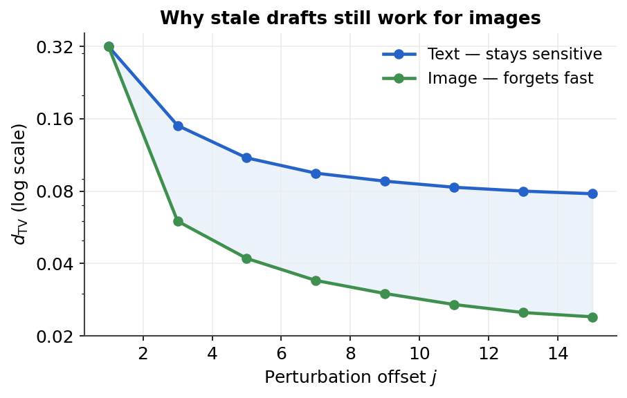
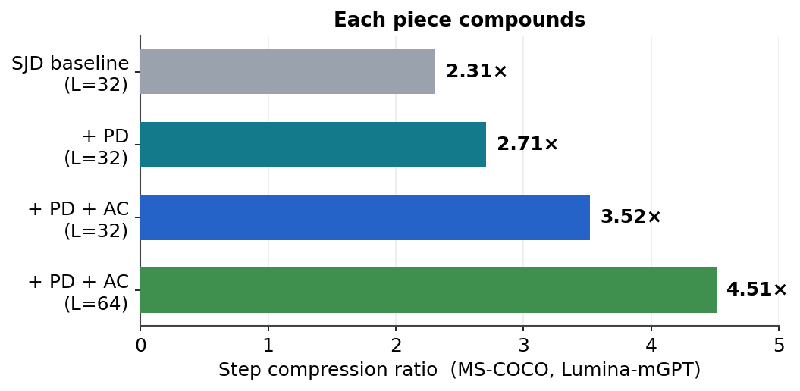

# SJD-PAC: Accelerating Speculative Jacobi Decoding via Proactive Drafting and Adaptive Continuation

*Jialiang Kang, Han Shu, Wenshuo Li, Yingjie Zhai, Xinghao Chen*


<a href="https://arxiv.org/abs/2603.18599"></a>


<p align="center">
  
</p>

## Overview

Speculative Jacobi Decoding (SJD) offers a draft-model-free approach to accelerate autoregressive text-to-image synthesis. However, the high-entropy nature of visual generation yields low draft-token acceptance rates in complex regions, creating a bottleneck that severely limits overall throughput. To overcome this, we introduce **SJD-PAC**, an enhanced SJD framework. First, SJD-PAC employs a **Proactive Drafting** strategy to improve local acceptance rates in these challenging high-entropy regions. Second, we introduce an **Adaptive Continuation** mechanism that sustains sequence validation after an initial rejection, bypassing the need for full resampling. Working in tandem, these optimizations significantly increase the average acceptance length per step, boosting inference speed while strictly preserving the target distribution. Experiments on standard text-to-image benchmarks demonstrate that SJD-PAC achieves up to a **4.62× step compression** and a **3.97× wall-clock speedup** with **lossless** image quality.

SJD-PAC is **training-free**, **model-agnostic**, and **rigorously lossless**. This repository implements it for [Lumina-mGPT](https://github.com/Alpha-VLLM/Lumina-mGPT). The SJD-PAC sampler lives in [`scheduler/sjd_pac_iteration_lumina_mgpt.py`](scheduler/sjd_pac_iteration_lumina_mgpt.py) and is applied to a `FlexARInferenceSolver` through `renew_pipeline_sampler`.

<p align="center">
  
</p>

The figure above pinpoints the bottleneck. SJD's accepted-tokens-per-step distribution is sharply long-tailed: in nearly **50% of forward passes it accepts only a single token**, contributing zero acceleration. The ~2× average speedup is thus disproportionately driven by a small fraction of steps that accept many tokens at once. SJD-PAC directly reshapes this distribution, shifting mass from inefficient short runs to highly efficient long ones.

## Method

SJD-PAC adds two synergistic, training-free components to the standard SJD verification loop.

#### Proactive Drafting (PD) — mitigates single-token stalls

A rejection at position *i* invalidates the context for every later draft, triggering a cascade of single-token acceptances in the next iteration. The moment a rejection occurs, PD builds a **shallow, wide K-ary tree** rooted at the resampled token (branching `K=4`, depth `D=3`) followed by a single chain extension out to the window length. By offering several diverse local candidates, at least one path is likely to survive verification — directly suppressing the single-token spike. The tree is built only locally on the (potentially stale) cached context, so it needs no extra model forward passes.

#### Adaptive Continuation (AC) — maximizes acceptance length

Standard SJD terminates the verification loop on the first rejection, discarding every subsequent draft token. AC removes this hard break: upon a rejection it resamples **only the failed token** and keeps verifying the remaining positions against the cached (stale) distributions, preserving the valid tail.

This works because image tokens forget distant context quickly. We perturb a single token at offset *j* and measure the Total Variation distance of the output distribution: for images `d_TV` collapses toward zero within a few positions, whereas text stays sensitive. The stale draft tail therefore remains valid and can be reused losslessly.

<p align="center">
  
</p>

Both components preserve the target distribution exactly (proofs in the paper's supplementary material), so SJD-PAC is lossless by construction. Their effects compound:

<p align="center">
  
</p>

## Requirements

The code requires `python>=3.10` and `transformers==4.47.1`. Install the PyTorch build matching your CUDA, then the remaining dependencies with pip:

```bash
# Tested environment: Python 3.10, CUDA 12.4, PyTorch 2.5.1
pip install torch==2.5.1+cu124 torchvision==0.20.1+cu124 \
    --extra-index-url https://download.pytorch.org/whl/cu124
pip install -r requirements.txt
```

This repository is also installable as a package via [`setup.py`](setup.py):

```bash
pip install -e .
```

## Usage

SJD-PAC is training-free — there are no checkpoints to download. You only need the base [Lumina-mGPT](https://github.com/Alpha-VLLM/Lumina-mGPT) weights (e.g. `Alpha-VLLM/Lumina-mGPT-7B-768`), which are fetched automatically into `--cache_dir` on first run. The workflow has three stages: a single-prompt demo, batched generation over a dataset, and quality evaluation.

### 1. Single-prompt demo

Generate images for the prompts listed in [`test_lumina_mgpt.py`](test_lumina_mgpt.py). The script wraps the inference solver with the SJD-PAC sampler and saves outputs under `./workdir/`:

```bash
CUDA_VISIBLE_DEVICES=0 python test_lumina_mgpt.py
```

The sampler is configured through `renew_pipeline_sampler`. Its key knobs are:

  - `tree_width`: the *K*-ary branching factor of Proactive Drafting (default `3`).
  - `tree_depth`: the depth *D* of the proactive draft tree (default `3`).
  - `max_num_new_tokens`: the Jacobi verification window length *L* (e.g. `64`).
  - `image_top_k` / `text_top_k`: top-*k* logit sampling for image / text tokens.
  - `guidance_scale`: classifier-free guidance weight (e.g. `3.0`).

### 2. Batched / multi-GPU generation

[`eval_model.py`](eval_model.py) runs SJD-PAC generation over a prompt dataset (e.g. PartiPrompts) across one or more GPUs:

```bash
python eval_model.py \
    --gpu_ids 0 \
    --model_name Alpha-VLLM/Lumina-mGPT-7B-768 \
    --dataset_name parti \
    --dataset_anno_file ./data/PartiPrompts.tsv \
    --max_num_new_tokens 64 \
    --tree_width 3 \
    --tree_depth 3 \
    --image_top_k 2000 \
    --guidance_scale 3.0
```

**Parameters**:

  - `--gpu_ids`: GPU id(s) to use; pass several for multi-GPU data-parallel generation.
  - `--model_name`: the base Lumina-mGPT checkpoint to accelerate.
  - `--dataset_name` / `--dataset_anno_file`: the prompt benchmark and its annotation file.
  - `--max_num_new_tokens`: Jacobi window length *L*.
  - `--tree_width` / `--tree_depth`: Proactive Drafting hyperparameters *K* and *D*.

### 3. Evaluation metrics

[`evaluation_metrics.py`](evaluation_metrics.py) computes FID / Inception Score / CLIP-Score over a directory of generated images:

```bash
python evaluation_metrics.py \
    --workdir ./workdir_parti-16 \
    --dataset_name parti_cocoformat \
    --dataset_anno_file ./data/PartiPrompts.tsv
```

## Evaluation Results

Main comparison against decoding baselines on the **MS-COCO 2017** and **PartiPrompts** benchmarks, using **Lumina-mGPT** and **Emu3**. We report Step Compression (↑), wall-clock Latency speedup (↑), FID (↓), and CLIP-Score (↑). **TF** = training-free, **LL** = lossless. **Bold** marks the best speedups within each lossless group.

| Model / Method | TF | LL | Step ↑ | Latency ↑ | FID ↓ | CLIP ↑ |
| :------------- | :-: | :-: | :----: | :-------: | :---: | :----: |
| **MS-COCO 2017** | | | | | | |
| Lumina-mGPT | ✓ | ✓ | 1.00× | 1.00× | 30.79 | 31.31 |
| &nbsp;&nbsp;w/ EAGLE | ✗ | ✓ | 2.94× | 2.10× | 30.68 | 31.73 |
| &nbsp;&nbsp;w/ SJD | ✓ | ✓ | 2.22× | 2.05× | 31.13 | 31.33 |
| &nbsp;&nbsp;w/ LANTERN++ | ✗ | ✗ | 3.19× | 2.28× | 29.96 | 30.11 |
| &nbsp;&nbsp;w/ GSD *(lossy)* | ✓ | ✗ | 3.39× | 3.62× | 33.12 | 31.25 |
| &nbsp;&nbsp;w/ SJD² | ✗ | ✗ | 4.02× | 2.81× | 31.40 | 31.80 |
| &nbsp;&nbsp;**w/ SJD-PAC (Ours)** | ✓ | ✓ | **4.51×** | **3.80×** | 30.69 | 31.21 |
| Emu3 | ✓ | ✓ | 1.00× | 1.00× | 31.12 | 31.05 |
| &nbsp;&nbsp;w/ SJD | ✓ | ✓ | 2.32× | 2.01× | 30.74 | 30.95 |
| &nbsp;&nbsp;w/ SJD² | ✗ | ✗ | 5.62× | 2.54× | 31.50 | 30.40 |
| &nbsp;&nbsp;**w/ SJD-PAC (Ours)** | ✓ | ✓ | **4.31×** | **3.25×** | 31.10 | 30.99 |
| **PartiPrompts** | | | | | | |
| Lumina-mGPT | ✓ | ✓ | 1.00× | 1.00× | – | 32.01 |
| &nbsp;&nbsp;w/ EAGLE | ✗ | ✓ | 2.86× | 2.01× | – | 32.01 |
| &nbsp;&nbsp;w/ SJD | ✓ | ✓ | 2.28× | 2.13× | – | 32.06 |
| &nbsp;&nbsp;w/ LANTERN++ | ✗ | ✗ | 3.02× | 2.10× | – | 31.07 |
| &nbsp;&nbsp;w/ GSD *(lossy)* | ✓ | ✗ | 3.76× | 4.65× | – | 31.25 |
| &nbsp;&nbsp;w/ SJD² | ✗ | ✗ | 3.82× | 2.51× | – | 31.54 |
| &nbsp;&nbsp;**w/ SJD-PAC (Ours)** | ✓ | ✓ | **4.62×** | **3.97×** | – | 32.07 |
| Emu3 | ✓ | ✓ | 1.00× | 1.00× | – | 31.85 |
| &nbsp;&nbsp;w/ SJD | ✓ | ✓ | 2.35× | 2.11× | – | 31.65 |
| &nbsp;&nbsp;w/ SJD² | ✗ | ✗ | 4.72× | 2.04× | – | 31.23 |
| &nbsp;&nbsp;**w/ SJD-PAC (Ours)** | ✓ | ✓ | **4.59×** | **3.51×** | – | 31.87 |

Across every configuration SJD-PAC sets a new state of the art for training-free, lossless T2I acceleration — outperforming all lossless baselines in both step reduction and wall-clock speedup, and remaining competitive with lossy methods (GSD, SJD², LANTERN++) **without their quality degradation**. The PD hyperparameters `K=4, D=3` and window `L=64` are the default sweet spot (see the ablation above and the paper's Tab. 3).

## Citation

If you find our work useful, please consider citing:

```bibtex
@inproceedings{kang2026sjdpac,
  title={SJD-PAC: Accelerating Speculative Jacobi Decoding via Proactive Drafting and Adaptive Continuation},
  author={Kang, Jialiang and Shu, Han and Li, Wenshuo and Zhai, Yingjie and Chen, Xinghao},
  booktitle={Proceedings of the IEEE/CVF Conference on Computer Vision and Pattern Recognition (CVPR)},
  year={2026}
}
```

## License

This project is licensed under <a rel="license" href="LICENSE">Apache License 2.0</a>. Redistribution and use should follow this license.

## Acknowledgements

This work is supported by Huawei Noah's Ark Lab. We would like to acknowledge the foundational work of previous projects that inspired our approach, especially [Lumina-mGPT](https://github.com/Alpha-VLLM/Lumina-mGPT) and [SJD](https://github.com/tyshiwo1/Accelerating-T2I-AR-with-SJD). We also thank the anonymous CVPR reviewers for their insightful comments and valuable feedback.
